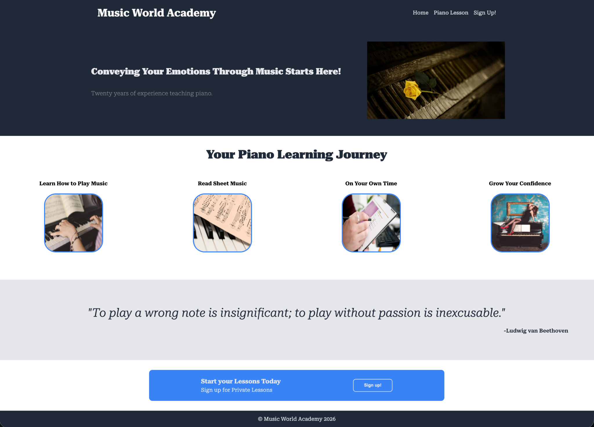

# Music World Academy Landing Page

A responsive landing page for a fictional piano academy built of the layout given as part of **The Odin Project Foundations** curriculum.

## Preview

## About

This project recreates a modern landing page using semantic HTML and CSS Flexbox. The goal was to practice structuring a webpage before styling it and to reinforce layout concepts learned throughout the Flexbox module.

## Features

- Semantic HTML5 structure
- Navigation with same-page links
- Hero section
- Information cards
- Inspirational quote section
- Call-to-action section
- Footer
- Responsive layout using Flexbox

## Technologies Used

- HTML5
- CSS3
- Flexbox

## What I Learned

During this project I practiced and learned:

- Planning page structure before writing any HTML or CSS.
- Writing semantic HTML
- Creating reusable components
- Organizing content into logical sections
- Using Flexbox to build responsive layouts
- Improving accessibility with image `alt` attributes

## Project Status

🚧 Completed

- The HTML structure is complete.
- CSS styling and responsive design are complete.

## Live Demo

Coming soon.

## Author

Ash Algabsani